# Tutoriel FL STUDIO

photo prise de [wikipédia](https://fr.wikipedia.org/wiki/FL_Studio)

## Qu'est-ce qu'Fl studio?

Fl studio (initialement FruityLoops), est un logiciel de production musicale. Créé par Didier Dambrin en 1997 par la firme belge image-line,  FL Studio a révolutionner le monde de la musique grace à ça facon de pouvoir créer de la musique facilement.

### ce logiciel comprend:  

- Un éditeur audio 

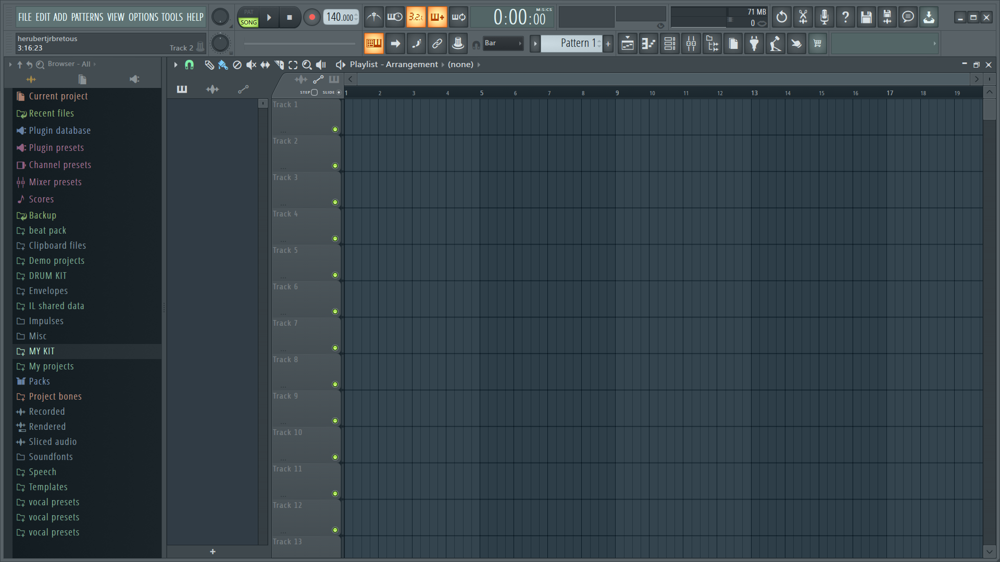

- Un séquenceur basé sur le concept de patterns

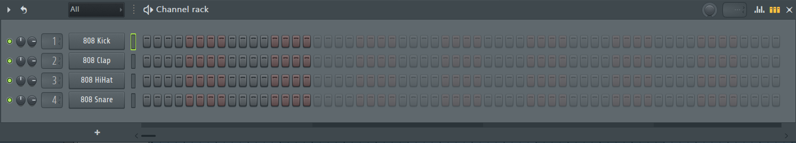

- Un Piano Roll

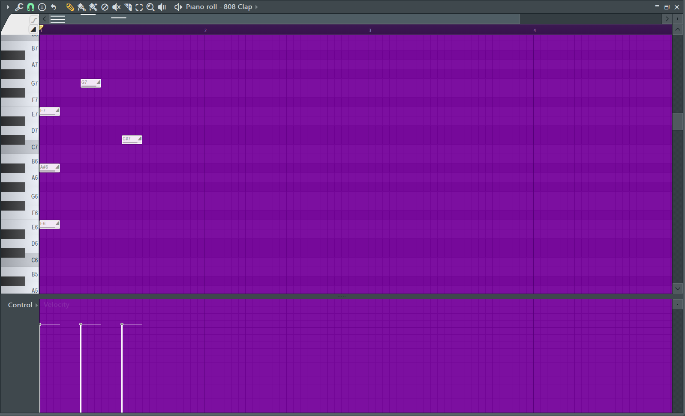

- Une banque de sons

- Un mixer

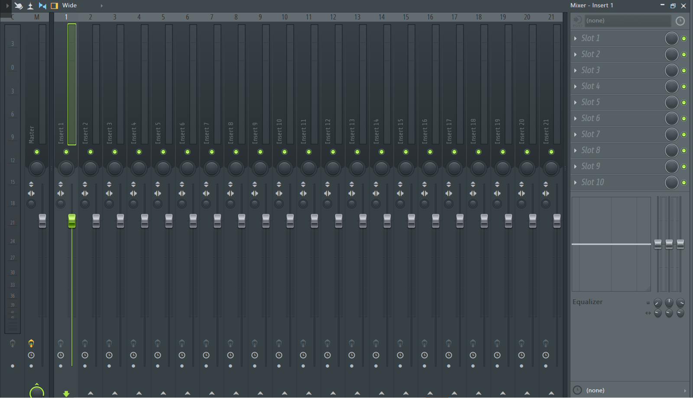

- Des VST's

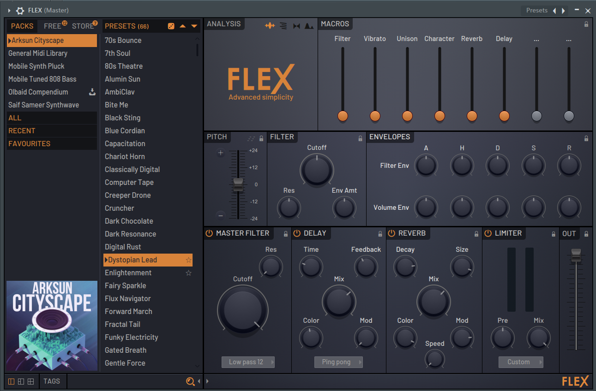

- Une barre d'outils et de selection de BPM (Battement par minute)

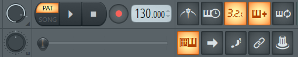

## Comment débuter?

	1. Changer le BPM au BPM désiré

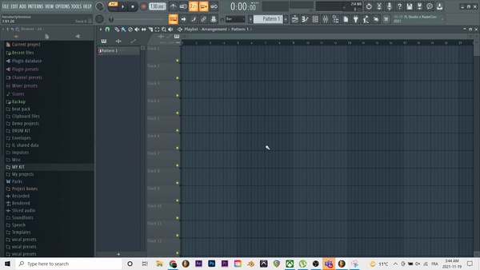

 
	2. Ouvrir le menu de VST's en appuyant sur le + du séquenceur et choisir le VST désiré
 
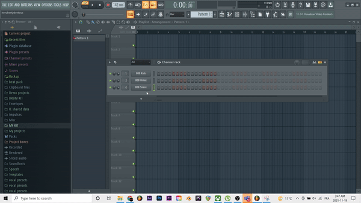

        3. Apres avoir choisi un intrument dans la bande de sons du VST, ouvrir le piano roll et placer des notes( créer une mélodie)

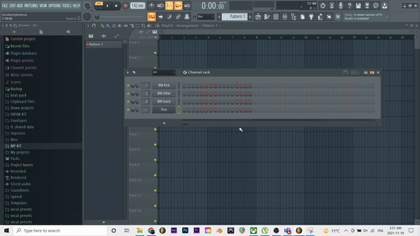

        4. Ajouter des drums par la bande de son de fl studio. Vous pouvez ensuite cliquer sur les temps du séquenceur pour ajouter les drums sur la mélodie.
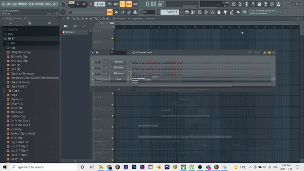

        5. Tout au long du tutoriel, vous pouvez appuyer sur jouer et arreter( ou appuyer sur la barre espace) pour pouvoir écouter votre chef-d'oeuvre.
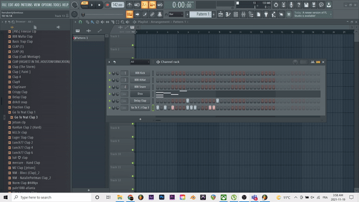

      5. Amusez-vous!!!

## Pour plus d'informations

[Pour acheter FL STUDIO et plus d'info...](https://www.image-line.com/fl-studio/)

