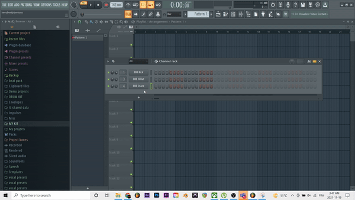

# Tutoriel FL STUDIO

## Qu'est-ce qu'Fl studio?

Fl studio (initialement FruityLoops), est un logiciel de production musicale. Créé par Didier Dambrin en 1997 par la firme belge image-line,  FL Studio a révolutionner le monde de la musique grace à ça facon de pouvoir créer de la musique facilement.

### ce logiciel comprend:  

- Un éditeur audio 

- Un séquenceur basé sur le concept de patterns

- Un Piano Roll

- Une banque de sons

- Un mixer

- Des VST's

- Une barre d'outils et de selection de BPM (Battement par minute)

## Comment débuter?

	1. Changer le BPM au BPM désiré

 
	2. Ouvrir la menu de VST's en appuyant sur le + du séquenceur et choisir le VST désiré
 

  3. Ou

   

## Pour plus d'informations

[Pour acheter FL STUDIO et plus d'info...](https://www.image-line.com/fl-studio/)

